```{r setup, include=FALSE}
knitr::opts_chunk$set(echo = FALSE)
```

## Plan of the course

1. Introduction to Rmd and git
2. SQL vs. dplyr
3. Templating with whisker
4. SQL vs. RSpark
5. Storage and introduction to ETL
6. Spark with R vs, Spark with Scala vs. Spark with Pyhton
7. Machine learning: Predicting demand
8. Recommender System with ALS
9. Project


# Buzzwords

## 

- Big Data
- Data Driven Decision Making
- Data Science
- Hadoop
- Hive/Impala/BigQuery
- Spark

# Big Data?

## 

<center>
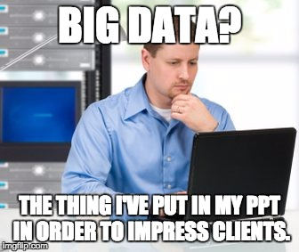
</center>


## 

<center>
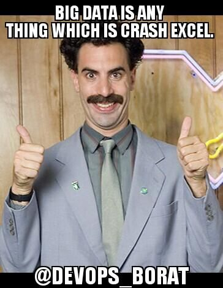
</center>

## Amazon's Big Data


<center>
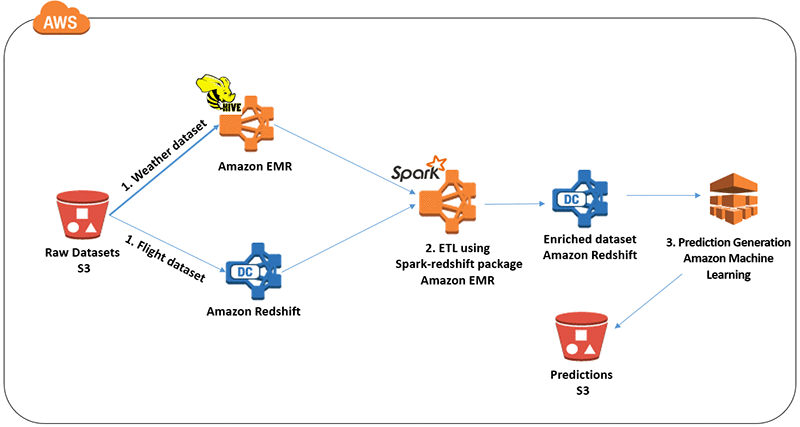
</center>

## Azure

<center>
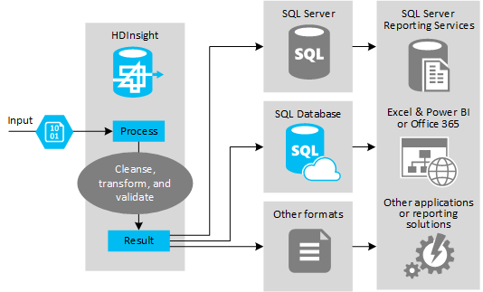
</center>

## Steaming 

<center>
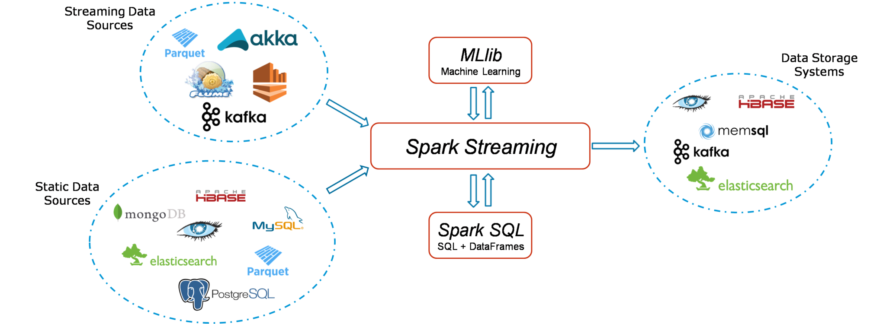
</center>

## Where we can store big data (from Quora)

White Brian, Marketing Manager - Silver Touch Technologies Ltd.

_The high velocity and veracity of the Big Data is the reason why the traditional warehouse is no longer suited to store Big Data. The structured and unstructured types of data is also reason enough why you need to look for tools that can help in storing the data and mine it properly for best results. Hadoop and Cloudera are tools that enterprises should use in order to store the structured and unstructured data. They create an enterprise hub, where the data is stored, and wherein security is given highest priority. Talend allows you to build your own data management system. I would recommend consulting Silver Touch to ensure you can store Big Data securely in your enterprise, and gather maximum insights from analyzing the data._

##

<center>
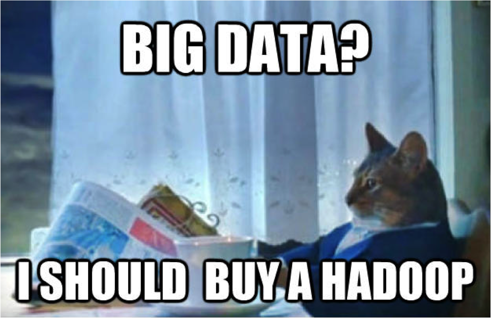
</center>

## Hadoop (from Wikipedia)

Apache Hadoop ( /həˈduːp/) is an open-source software framework used for distributed storage
and processing of dataset of __big data__ using the __MapReduce__ programming model. 

It consists of computer clusters built from commodity hardware. All the modules in Hadoop are designed with a fundamental assumption that hardware failures are common occurrences and should be automatically handled by the framework.

## Hadoop (from Wikipedia)

The core of Apache Hadoop consists of a storage part, known as __Hadoop Distributed File System (HDFS)__, 
and a processing part which is a __MapReduce programming model__. 

Hadoop splits files into large blocks and distributes them across nodes in a cluster. 
It then transfers packaged code into nodes to process the data in parallel. 
This approach takes advantage of data locality, where nodes manipulate the data they have access to. 
This allows the dataset to be processed faster and more efficiently than 
it would be in a more conventional supercomputer architecture that relies on a parallel 
file system where computation and data are distributed via high-speed networking.

## \

<br>

<center>
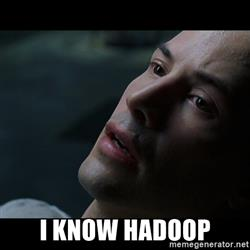
</center>

## Hive

SQL interface to Hadoop


<center>

</center>

## Impala/Hive Interacitve/Presto

<center>
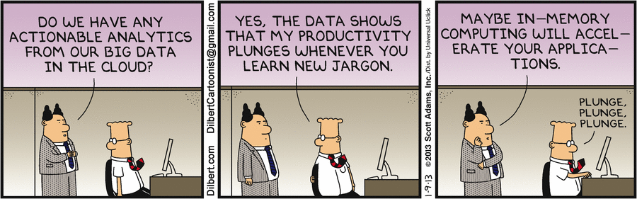
</center>

## Spark (from Wikipedia)

Apache Spark provides programmers with an application programming interface centered on a data structure called the resilient distributed dataset (RDD), a read-only multiset of data items distributed over a cluster of machines, that is maintained in a fault-tolerant way.

It was developed in response to limitations in the MapReduce cluster computing paradigm, which forces a particular linear dataflow structure on distributed programs: MapReduce programs read input data from disk, map a function across the data, reduce the results of the map, and store reduction results on disk. Spark's RDDs function as a working set for distributed programs that offers a (deliberately) restricted form of distributed shared memory.

## Spark Components

* Spark Core
* Spark's Data Frames
* Spark SQL
* Spark Streaming
* MLlib


## Can I do Deep Learning with Spark?

Not directly. 

* MXNet
* Tensorflow 
* SparkNet


# Exercise 1: Git

##

<https://github.com/sbartek/github_exercise>

# Exercise 2: SQL vs. dplyr

##

<https://github.com/sbartek/sql_dplyr_exercise>

# Data Driven Decision Making 

## Scenario A

<center>
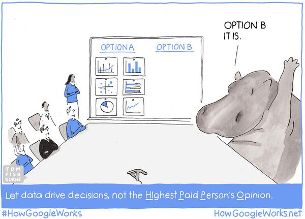
</center>

## Scenario B

<center>
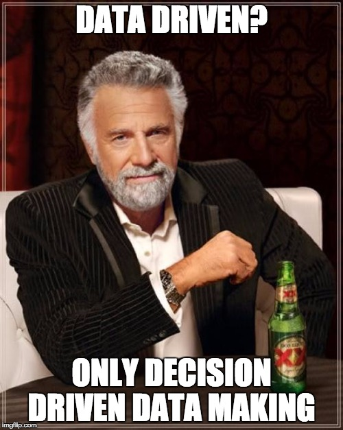
</center>

## Scenario C

<center>
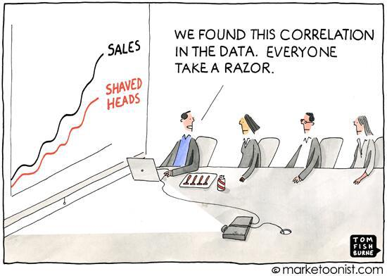
</center>

## So what does Data-Driven mean?

* How can we measure impact of our decision?

## So what does Data-Driven mean?

### Is our argument based on data?
* Big Data: 
    - Have we done something similar in the past? 
    - How we are doing now? Thanks, fine.
* Small Data: Not always the bigger the better. 
    - Ask your customers. 
    - Have you actually used our app?
* No Data: 
    - Can we learn something from it?
    
## So what does Data-Driven mean?    
    
* Correlation does not imply causation: A/B Test it, you idiot!


<center>
<br>

</center>


## We need Data Scientist (maybe).


<center>
<br>
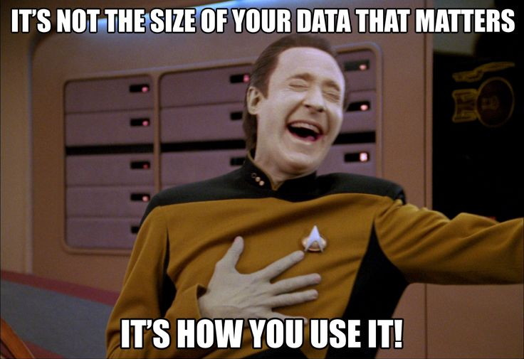
</center>


## Versions of Data Scientist

* Data Engineer:
    - set up infrastructure
    - transforming unstructured data into structured
    - some basic analysis
    - monitoring main metrics 

    
## Versions of Data Scientist

* Data Analyst: 
    - quering DB
    - pivoting Excel Tables
    - making excel plots
    - making Tableau dashboards
    - A/B Tests 

<center>
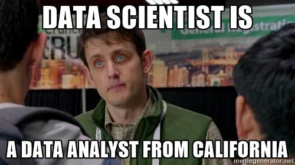
</center>


## Data Scientist

* Machine Learning:
    - statistical modeling
    - creating products like Recommender System, Forecasting Consumption 

<center>

</center>
    
## Data Scientist

* Data Scientist:
    - A bit of everything above

<center>
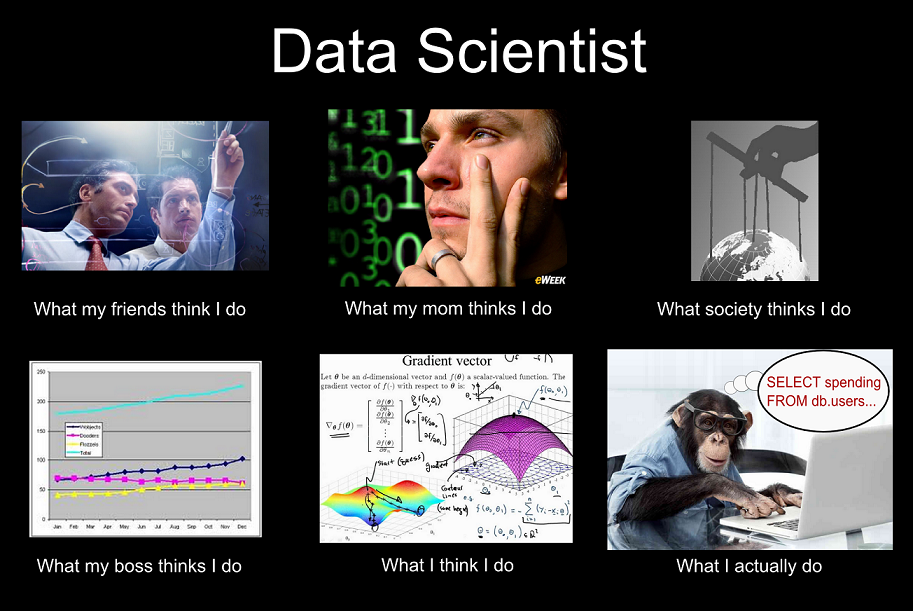
</center>


## Programming knowledge

Basically now there are two groups of Data Scientists:

* R
* Python

<center>
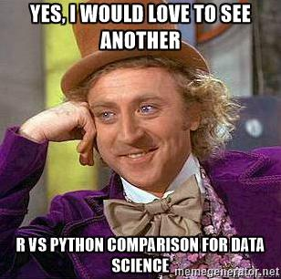
</center>

## What Data Scientist should know

## What R Data Scientist should know


## What R Data Scientist should know


* python

## What R Data Scientist should know 

* effective table manipulation: data.table, dplyr
* viz: ggplot2, dashboards: shiny
* reporting: ppt, rmd notebooks
* SQL (Hive)
* Machine Learnig/Deep Learning
* Good editor: RStudio, Emacs
* git, unix shell
* A/B testing and some stats
* Reading something about your business does not harm 
* Selling skills

